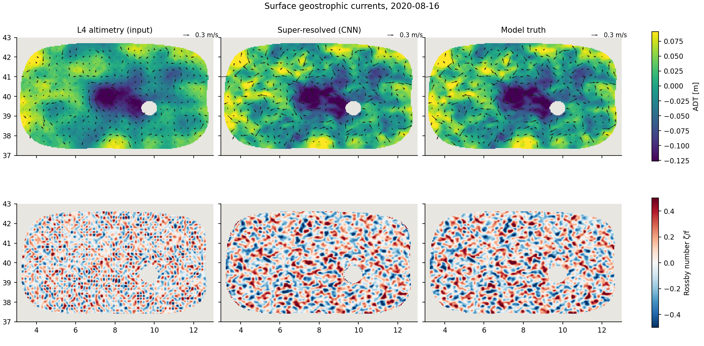
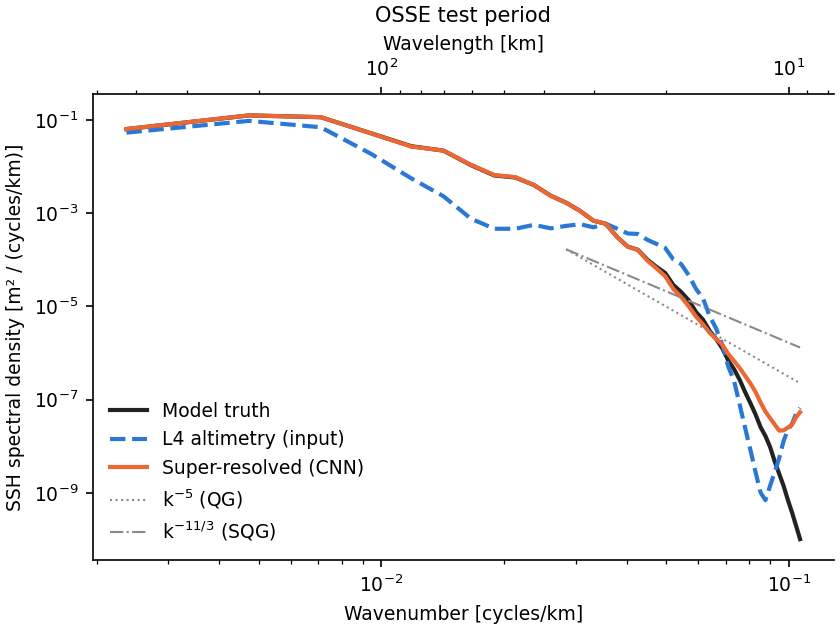
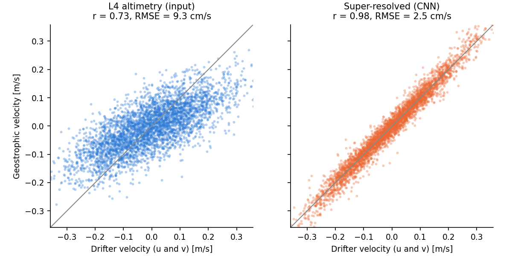

# Submesoscale Ocean Dynamics Modeling

**Physics-informed CNN super-resolution of ocean surface currents from satellite altimetry and SST.**

Gridded satellite sea-level maps (L4 ADT) can't resolve eddies and fronts smaller than about 100 km.
This project trains a convolutional network on a high-resolution ocean reanalysis. There the true
fine-scale field is known, which makes it an *Observing System Simulation Experiment* (OSSE). The
trained network is then applied to **real** Copernicus ADT + SST to reconstruct sharper geostrophic
currents. The results are validated against **independent drifting buoys** and by **wavenumber-spectral
analysis**.

[](../../actions/workflows/ci.yml)

**▶ Live demo: https://submesoscale.vercel.app**. The trained network runs *in your browser*. You can scrub
through days, compare the input, the AI output and the truth, and try the experiments (extra satellite noise,
hiding the temperature input).

<p align="center"></p>

## What is new here compared with the reference study

The reference study is Ciani, Fanelli & Buongiorno Nardelli, *Ocean Science* 21, 199–216 (2025): the whole Mediterranean, 2008–2019, using a dilated adaptive residual network (dADR-SR). This project differs in four ways:

| | Reference study | This project |
|---|---|---|
| Region | Whole Mediterranean | **Alboran–Balearic sub-basin** at 1/24° (plus a **Black Sea** configuration) |
| Period | 2008–2019 | **2022–2024**, which overlaps the **SWOT** wide-swath altimetry era |
| Loss function | Physics-informed (dynamical) loss terms | ADT + geostrophic velocity + **Rossby-number (ζ/f)** + **isotropic log-spectrum** terms |
| Diagnostics | RMSE, spectra | + **effective resolution** (spectral score) and a **10–50 km band-energy ratio** that separates real fine-scale energy from artefacts |

## Quick start (no account needed)

```bash
git clone <this repo> && cd submesoscale
python -m venv .venv && source .venv/bin/activate
pip install -e ".[dev]"
submeso all -c configs/demo_synthetic.yaml      # about 3 min on a laptop GPU, about 15 min on CPU
```

This runs the complete pipeline on a synthetic **surface-quasi-geostrophic** "nature run": a semi-enclosed
basin whose SST is tied to SSH by SQG physics, with simulated drifters. Results go to `runs/demo_synthetic/`.
On Google Colab, open [`notebooks/colab_quickstart.ipynb`](notebooks/colab_quickstart.ipynb).

## Real data: Western Mediterranean

1. Register (free) at [Copernicus Marine](https://data.marine.copernicus.eu/register), then run `copernicusmarine login`.
2. Install the data extra and run the pipeline:

```bash
pip install -e ".[data]"          # add ",maps" for cartopy coastlines
submeso download    -c configs/wmed.yaml   # ~10 GB model + L4 + GDP drifters (resumable)
submeso prepare     -c configs/wmed.yaml   # model truth -> 1/24 deg target grid
submeso pairs       -c configs/wmed.yaml   # OSSE: degrade truth to L4-like inputs
submeso train       -c configs/wmed.yaml   # ~1-2 h on a single GPU / Colab T4
submeso evaluate    -c configs/wmed.yaml   # OSSE test year (truth known)
submeso reconstruct -c configs/wmed.yaml   # real L4 ADT + SST, 2022-2024
submeso validate    -c configs/wmed.yaml   # drifters + spectra
submeso visualize   -c configs/wmed.yaml   # maps + animation
```

Any config value can be overridden on the command line, for example `-o train.epochs=5 -o model.name=srcnn`.
The dataset IDs in `configs/` were checked against the Copernicus Marine catalogue. For the full list and
the citations, see [docs/data_sources.md](docs/data_sources.md).

## Pipeline

```
 Copernicus reanalysis (1/24°)  ──► hr_truth ──► OSSE degrade ──► (ADT_lr, SST) → ADT_hr pairs ──► train CNN
                                                (smooth → 1/16° grid → noise → cubic back)            │
 Copernicus L4 ADT (1/16°) + L4 SST (0.05°) ──► same regridding path ──► trained CNN ◄───────────────┘
                                                                         │
                                         ADT_sr ──► geostrophic u, v, ζ/f ──► drifters · spectra · maps
```

| Module | Purpose | Requirement |
|---|---|---|
| `data/copernicus.py`, `validation/drifters.py` | Retrieval of CMEMS products and GDP drifters | FR-1 |
| `data/osse.py`, `data/synthetic.py` | OSSE training pairs, synthetic nature run | FR-2 |
| `models/networks.py` | SRCNN baseline + EDSR-style dilated residual network | FR-3 |
| `models/losses.py` | Physics-informed loss (geostrophy, Rossby number, spectrum) | FR-4 |
| `physics.py`, `inference.py` | Geostrophic currents, vorticity, tiled inference | FR-5 |
| `validation/drifters.py` | RMSE, correlation, vector correlation against drogued drifters | FR-6 |
| `validation/spectra.py`, `validation/metrics.py` | Spectra, slope, effective resolution, band-energy ratio | FR-7 |
| `viz/plots.py` | Maps, spectra, scatter plots, animations | FR-8 |

The method and its equations are in [docs/methodology.md](docs/methodology.md).

## Demo results (synthetic OSSE)

These numbers come from the synthetic demo on the held-out test month and simulated drifters.
**They show that the pipeline works; they are not a scientific result.** In the synthetic world SST is
tied to SSH exactly by SQG theory, so SST is far more informative there than it is in the real ocean.
Expect smaller gains on real data.

| Metric | L4 input | Super-resolved |
|---|---|---|
| ADT RMSE | 1.38 cm | **0.28 cm** |
| Geostrophic speed RMSE | 11.2 cm/s | **1.8 cm/s** |
| Rossby-number correlation | 0.14 | **0.98** |
| Effective resolution | 71 km | **17 km** |
| 10–50 km energy ratio (1 = correct) | 0.39 | **1.00** |
| Drifter vector RMSE (1,920 daily obs, 60 drifters) | 13.1 cm/s | **3.5 cm/s** |

<p align="center">


</p>

The spectrum also shows a known limitation: the network adds a little **excess energy below about 12 km**,
close to the grid scale. That is the kind of artefact the spectral check (FR-7) is there to catch.

## Web app (`site/`)

The site at https://submesoscale.vercel.app runs the trained CNN with
[onnxruntime-web](https://onnxruntime.ai/docs/get-started/with-javascript/web.html).
`site/assets/physics.js` is a JavaScript copy of `physics.py` and of the tiling in `inference.py`. The
app compares its live output with the Python reconstruction (they agree to within 0.01 mm), and the
tests check that the JavaScript physics matches the Python physics.

```bash
pip install -e ".[web]"
submeso export-web -c configs/demo_synthetic.yaml            # synthetic test month (truth known)
submeso export-web -c configs/wmed.yaml --source real        # real satellite data, after `reconstruct`
sh scripts/build_site.sh && python -m http.server -d site    # preview on http://localhost:8000
```

`export-web` writes `site/model.onnx` and `site/data/` (about 8 MB for 31 days). Commit both and push:
Vercel runs `scripts/build_site.sh`, which fetches the pinned onnxruntime-web files and checks their
SHA-256 checksums, and then redeploys. The COOP/COEP headers in `vercel.json` make the page
cross-origin isolated, so inference can use multi-threaded WASM (about 0.5 s per map instead of 1.7 s).

## Development

```bash
pip install -e ".[dev]" && pre-commit install
pytest                # 33 tests, including an end-to-end smoke test and a JS-vs-Python physics check
ruff check . && ruff format --check .
```

The code is laid out as `src/submeso/` (the package), `configs/` (one YAML per experiment), `tests/`, and
`docs/`. Every stage reads and writes files in `data/<region>/` and `runs/<experiment>/`, and each run
saves the exact config it used (`runs/<exp>/config.yaml`), so any result can be regenerated.

## Project notes

- [docs/iris_notes.md](docs/iris_notes.md) lists the originality claims, the anonymity checklist, and how each requirement is covered.
- Why not the Black Sea as the primary region? The Global Drifter Program has almost no drogued drifters there after 2010, so in-situ validation (FR-6) would not be possible.

## License & citation

Code: MIT (see [LICENSE](LICENSE)). The data belongs to its providers; see [docs/data_sources.md](docs/data_sources.md) for the required acknowledgements. To cite this software, see [CITATION.cff](CITATION.cff).
